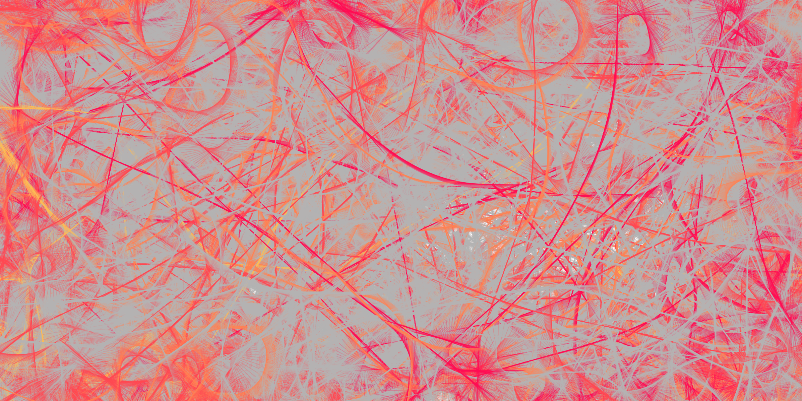
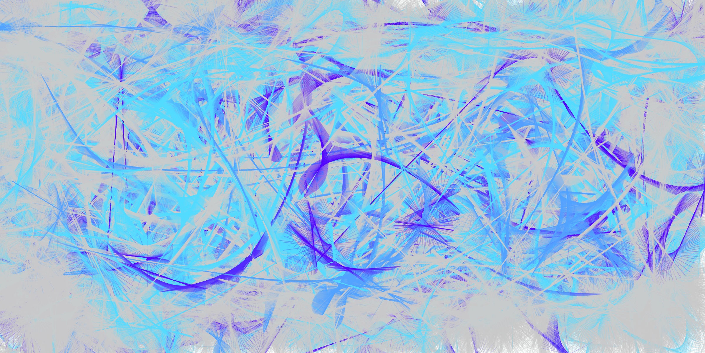
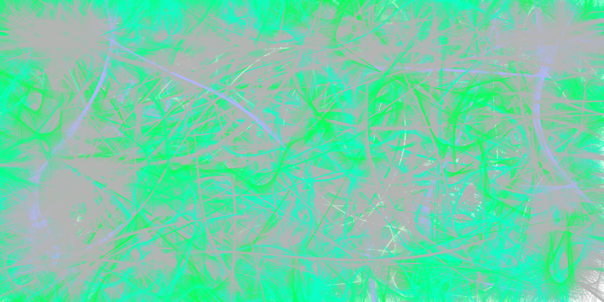

# Hominidae

**A series of computational simulations of social and reproductive behaviour in great apes.**

Hominidae is a series of three interactive simulations built with **p5.js**, based on orangutans, gorillas, and chimpanzees.

Each simulation creates a population of individual animals with their own properties and behaviours. They move around the canvas, respond to nearby animals, reproduce, and change behaviour based on what is happening around them.

## Pongo

**Orangutans — attraction, avoidance and pursuit**

The orangutan simulation starts with a population of individuals with different ages, sexes, sizes and male types.

Their movement is handled using **p5.Vector**. Females in estrus are attracted towards larger males and avoid smaller males. Larger males are slower, while smaller males are faster and can chase females to force mating.

When reproduction occurs, offspring inherit characteristics from their parents, including the male type when the offspring is male.

[**Experience Pongo**](https://soumya-talwar.github.io/hominidae/pongo/)

## Gorilla

**Gorillas — groups, competition and infanticide**

The gorilla simulation is built around groups of females led by a dominant silverback, with other males moving around outside the group.

Females follow their silverback, while males without a group compete for access to females. A male with fewer than three females can attack an infant belonging to another male. When an infant is killed, its mother leaves her existing group and joins the male who killed it.

The simulation therefore changes the group structure based on these interactions: a single attack can cause a female to leave one group and form a new reproductive relationship with another male.

[**Experience Gorilla**](https://soumya-talwar.github.io/hominidae/gorilla/)

## Pan

**Chimpanzees — hierarchy, competition and dominance**

The chimpanzee simulation creates a hierarchy among adult males based on age.

Higher-ranking males can chase lower-ranking males away from females in estrus. Lower-ranking males can challenge males immediately above them and move up the hierarchy if they win.

Males can also repeatedly interact violently with females, causing the female's state to change to reflect submission.

[**Experience Pan**](https://soumya-talwar.github.io/hominidae/pan/)

## How it works

All three simulations use individual objects to represent the animals.

Each animal keeps track of properties such as:

- position and velocity
- age
- sex
- size or physical type
- reproductive state
- relationships with other animals

Movement is handled using **p5.Vector**, with calculations for distance, direction, attraction, avoidance and pursuit.

The animals respond to one another based on their properties and current state. Reproduction creates new individuals, while age determines when individuals become adults and eventually die.

The simulations also use colour to represent reproductive interactions. Animals change colour during mating to distinguish between consensual and forced mating, making these interactions visible as they happen in the simulation.

The simulations run continuously, allowing the population and its relationships to change as the individual behaviours play out.

## Built with

- **p5.js**
- **JavaScript**
- **p5.Vector**
- Object-oriented programming
- Generative simulation
